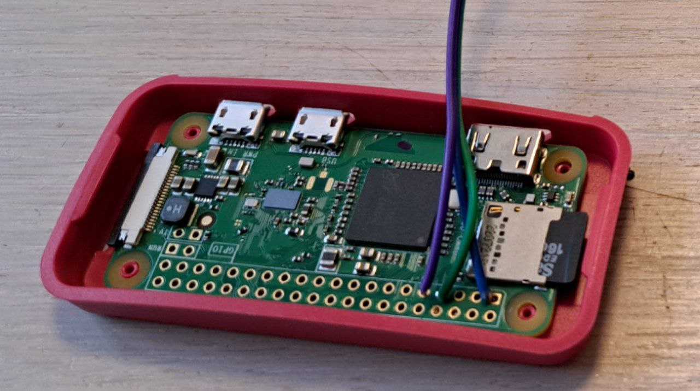
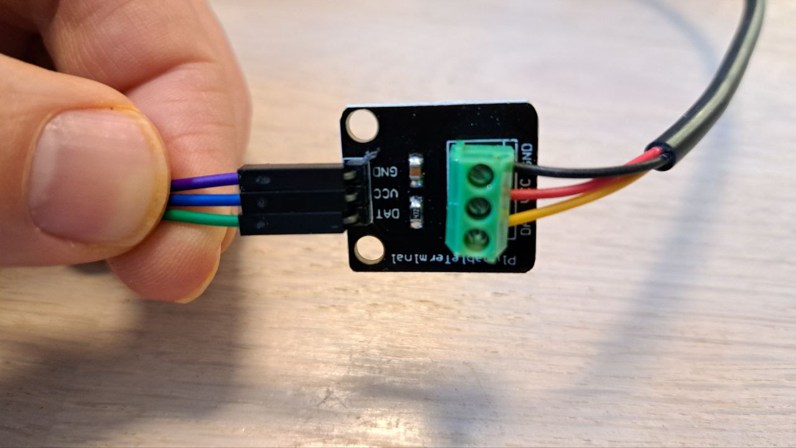

# HOWTO

## Pinout

### Solger wires

Solger wires to pins `1`, `7` and `9`:
- 3V3, Power
- `GPIO4`, note number `4`
- Ground

Note the colors.

### Connect resistor

Make sure colors match.
- Ground is purple
- Power is Blue
- Data us green 

### Connect thermometer

Colors are not random in this case.
- Black is Ground
- Orange is power
- Yellow is Data

## First run

First run of Raspbery PI is done with Display and keyboard connected.
Start it, follow instructions.
- Add wifi
- Add user (and ssh key)
- Remove GUI, it will save a lot of boot time

## Setup

Setup is done by [Ansible](../ansible/README.md) playbook.

- [ansible](../ansible/README.md)

## Internet

Once PI is configured and cronjob enabled you can spin up a frontend app in internet.

- [therometer-app](../thermometer-app/)
- [helm](../helm/)