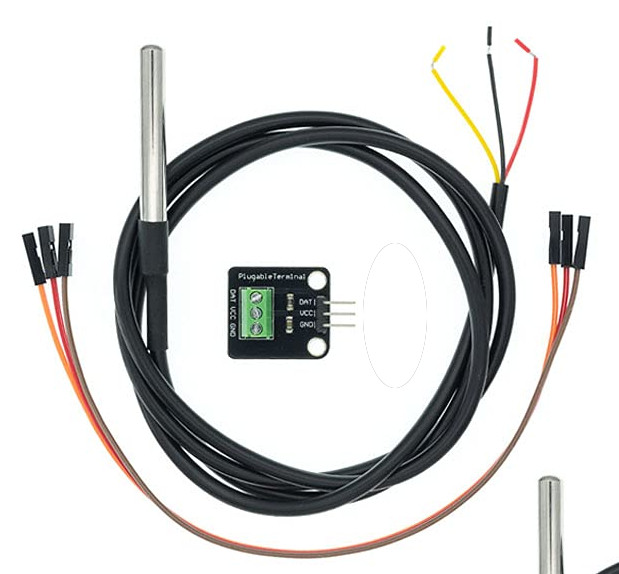
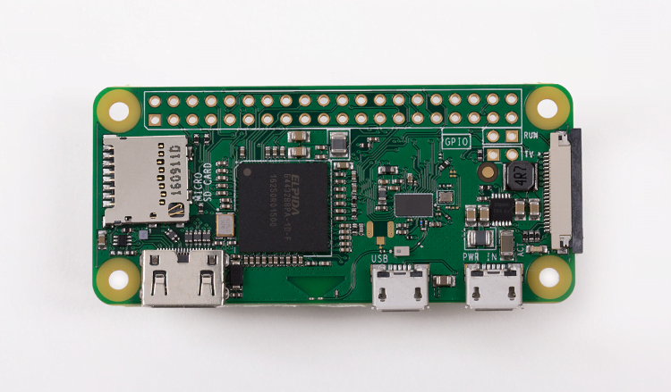
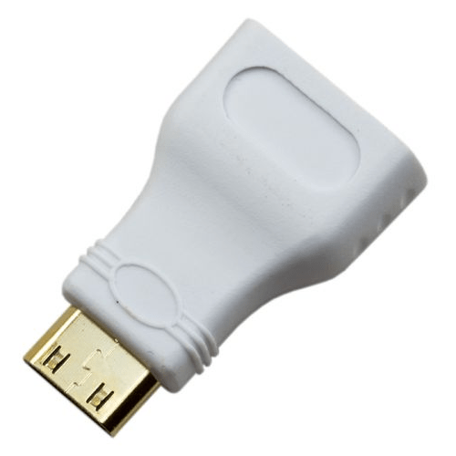
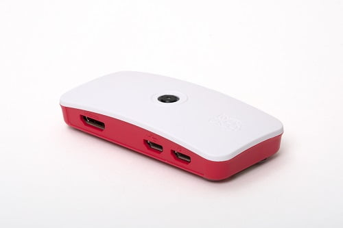

# Shopping list

- Thermometer
- Raspberry PI

## Thermometer

### DS18B20

Pick cable of proper length.
https://www.amazon.de/s?k=DS18B20

### Resistor

### 3 wires

## Raspberry PI

https://raspberrypi.dk/en/product/raspberry-pi-zero-w/

### Raspberry PI Zero W

Raspberry Pi Zero W - is known to work, it is compact, but will require soldering

Any raspberry PI with wifi will do. Probably other similar boards will work too. This reposiory assumes debian to be on board.

### Micro SD Card

16GB with Raspberry PI OS. SD card with Raspberry OS will do fine

- https://www.raspberrypi.com/software/

### Power

Micro USB power adapter

### Midi HDMI

### Case

Official Raspberry Pi Zero Case

